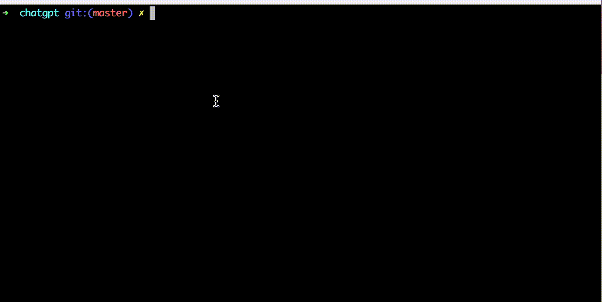

chatgpt: Chat GPT console client in Golang
======================

 

English | [中文](README_zh.md)

A Golang console client for ChatGPT (<https://chat.openai.com>) using GPT

Features
--------------

- Chat Completions API with streaming output and multi-turn conversation memory
- Selectable model (`--model` / `OPENAI_MODEL`) and custom base URL (`--base-url` / `OPENAI_BASE_URL`) for Azure OpenAI or other OpenAI-compatible services
- Non-interactive and piped input (`-p`)
- `/save` and `/load` conversations (JSON), `/system`, `/reset`
- Token usage and estimated cost, colored code blocks, Ctrl+C to interrupt, request timeout

Install
--------------

    go get -u -x github.com/kkdai/chatgpt

Request for API from OpenAI
---------------------

Request your OpenAPI key in [https://platform.openai.com/api-keys](https://platform.openai.com/api-keys)

Usage
---------------------

    export API_KEY=YOUR_KEY   # or OPENAI_API_KEY
    chatgpt

Options:

    -m, --model string     model to use (default "gpt-4o", env OPENAI_MODEL)
    -s, --system string    system prompt
    -p, --prompt string    send one prompt and exit
        --base-url string  OpenAI-compatible API base URL (env OPENAI_BASE_URL)
        --timeout duration maximum time for one answer (default 5m0s, 0 for no limit)

For one-shot or piped use, pass a prompt with `-p`; piped text is appended to
that prompt. Piped input without `-p` is sent as a single prompt:

    cat file.txt | chatgpt -p "Summarize this"
    echo "What is Go?" | chatgpt

The conversation keeps its history across interactive questions. In-session
commands: `/system <prompt>`, `/reset`, `/save <file>`, `/load <file>`, `/image <file>`,
`/help`, `quit` / `exit`. Conversation files use JSON; `/save` refuses to
overwrite an existing file unless `/save --force <file>` is used. Press Ctrl+C
while an answer is streaming to interrupt it.

When the API reports token usage, it is printed to stderr along with an
estimated cost for supported GPT-4o and GPT-4.1 models. Estimates use published
per-token rates and may not match provider-specific pricing. Code fences are
colored when output is a terminal; redirected output remains plain text.

Snapshot
---------------

Contribute
---------------

Please open up an issue on GitHub before you put a lot efforts on pull request.
The code submitting to PR must be filtered with `gofmt`

License
---------------

This package is licensed under MIT license. See LICENSE for details.

## Reasoning, vision and structured output

- `--reasoning-effort low|medium|high` (env `OPENAI_REASONING_EFFORT`) for o-series models.
- `/image <file>` attaches a local image to the next question (vision-capable models).
- `--json-schema '<schema>'` or `--json-schema @schema.json` forces output to match a JSON schema.
